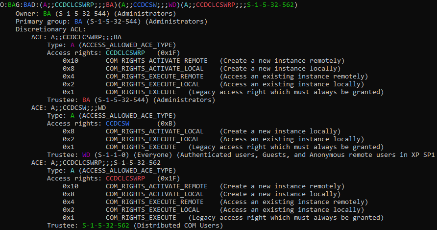

# Windows Security Descriptor Definition Language (SDDL)

A simple SDDL parser for many Windows securable object types. Resolves generic access right requests based on the results
of [another toy project](https://github.com/mtth-bfft/nt-object-types).
You can use this tool to pretty-print security descriptors, access masks, SIDs, etc. and learn about the security model of the following:

- Active Directory objects
- DCOM
- Events, Semaphores, Timers
- Mutants/mutexes
- Files and directories
- File mappings/sections
- Jobs
- Named pipes
- Processes and Threads
- Registry keys
- Services and the Service Control Manager
- Tokens
- Window Stations

## Examples

- You can parse security descriptors of files (not specifying `--type=file` will yield generic results where type-specific bits won't be decoded):
```
C:\> cacls .\secret.txt /S
    "D:(A;;FA;;;SY)(A;;FA;;;BA)(A;;FA;;;S-1-5-21-2660493220-2051396753-1551960823-1001)"

C:\> python sd.py --type=file "D:(A;;FA;;;SY)(A;;FA;;;BA)(A;;FA;;;S-1-5-21-2660493220-2051396753-1551960823-1001)"
```


- You can parse security descriptors in text SDDL, but also in binary form like COM settings in the registry:
```
C:\> reg query HKEY_LOCAL_MACHINE\SOFTWARE\Microsoft\Ole /v MachineLaunchRestriction 
    DefaultLaunchPermission    REG_BINARY    01000480C8000000D800000000000000140000000200[...]
C:\> python sd.py --type=com 01000480C8000000D800000000000000140000000200[...]
```


- You can parse the security descriptor checked when accessing AppLocker's identification service:
```
C:\> sc sdshow appidsvc
    D:(A;;CCLCSWRPWPDTLOCRRC;;;SY)(A;;CCDCLCSWRPWPDTLOCRSDRCWDWO;;;BA)(A;;CCLCSWLOCRRC;;;IU)(A;;CCLCSWLOCRRC;;;SU)

C:\> python sd.py --type=service "D:(A;;CCLCSWRPWPDTLOCRRC;;;SY)(A;;CCDCLCSWRPWPDTLOCRSDRCWDWO;;;BA)(A;;CCLCSWLOCRRC;;;IU)(A;;CCLCSWLOCRRC;;;SU)"
```

- You can parse the Service Control Manager's own security descriptor:
```
C:\> sc sdshow scmanager
D:(A;;CC;;;AU)(A;;CCLCRPRC;;;IU)(A;;CCLCRPRC;;;SU)(A;;CCLCRPWPRC;;;SY)(A;;KA;;;BA)(A;;CC;;;AC)(A;;CC;;;S-1-15-3-1024-528118966-3876874398-709513571-1907873084-3598227634-3698730060-278077788-3990600205)

C:\> python sd.py --type=scm "D:(A;;CC;;;AU)(A;;CCLCRPRC;;;IU)(A;;CCLCRPRC;;;SU)(A;;CCLCRPWPRC;;;SY)(A;;KA;;;BA)(A;;CC;;;AC)(A;;CC;;;S-1-15-3-1024-528118966-3876874398-709513571-1907873084-3598227634-3698730060-278077788-3990600205)"
```

## FAQ

- Why create a parser project instead of just using `ConvertStringSecurityDescriptorToSecurityDescriptor()`?

That function would indeed work for some security descriptors, and avoids re-implementing a SDDL parser. But try to parse that (simple, widespread) security descriptor on a non-Active-Directory-joined host: `D:(A;;FA;;;SY)(A;;FA;;;DA)`. It will fail with error 1337 (`ERROR_INVALID_SID`) because the `Domain Admins` (DA) group doesn't exist on your host. Similarly, you'll have trouble using that advapi32.dll function on a UNIX host, except using Wine.

## Contributing

If you find a SDDL string or binary security descriptor these script parse or display incorrectly, open an issue.

If you would like to have new object types supported, open an issue, ideally with pointers to documentation or examples.
